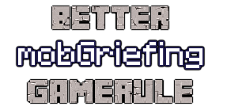

  
[](LICENSE)

## About
"Better mobGriefing GameRule" is a Minecraft mod which improves the
"mobGriefing" game rule, allowing separate values to be specified for individual
types of entity.

## Command Usage
The standard `/gamerule mobGriefing true|false` command has been extended to
allow the entity to be specified as part of the command in the format `/gamerule
mobGriefing <entity> inherit|true|false`. When the value is `inherit` the
entity's mobGriefing behaviour will be inherited from the original game rule.

The `entity` value accepts the same arguments as the `/summon` command and new
entity types will automatically be added when given in the command arguments,
e.g.`/gamerule mobGriefing creeper false` or `/gamerule mobGriefing
minecraft:creeper false`.

When a world is loaded initial values for entities will be populated based on
the current configuration values.

## Configuration Usage
The initial values of the mobGriefing game rules can be set using the in-game
mod configuration menu, these can be changed for both the global mobGriefing
game rule and each individual entity.

The specified initial values will be used to set the mobGriefing values during
world creation as well as any missing entity rules when loading existing worlds.

A number of entities will automatically be included in the configuration file,
consisting of the entities in the "Mob Specific", "Active Actions" and
"Projectiles" sub-sections of the "Mob Griefing Effects" section.

Entity configuration entries are in the format `"namespace:entity" =
"INHERIT|TRUE|FALSE"`.

The configuration file uses the Forge config structure:
```toml
[global]
  mobGriefing = false

[entity]
  "minecraft:creeper" = "FALSE"
  "minecraft:enderman" = "INHERIT"
  "minecraft:villager" = "TRUE"
```

## Mob Griefing Effects
### Mob Specific
Effects which are coded directly in to the mob.

| Name         | Effect                                 | Version |
| ------------ | -------------------------------------- | ------- |
| Creeper      | Can destroy blocks when exploding.     | 1.7+    |
| Ender Dragon | Can destroy blocks on touch.           | 1.7+    |
| Enderman     | Can pickup and place blocks.           | 1.7+    |
| Evoker       | Can Wololo sheep.                      | 1.11+   |
| Fox          | Can eat berries.                       | 1.14+   |
| Rabbit       | Can eat carrots.                       | 1.8+    |
| Ravager      | Can destroy crops and leaves.          | 1.14+   |
| Silverfish   | Can hide in and destroy stone blocks.  | 1.9+    |
| Snow Golem   | Can leave snow trails.                 | 1.9+    |
| Wither       | Can destroy blocks on spawn and touch. | 1.7+    |
| Zombie*      | Can attack turtle eggs.                | 1.13+   |

\* Inherited by Drowned, Husk, Zombie Villager and Zombified Piglin.

### Shared
Effects which are coded as reusable behaviours, but may only be used by a single
mob by default.

#### Active Actions
Effects which occur due to an action actively taken by a mob.

| Effect                                        | Used By              | Version |
| --------------------------------------------- | -------------------- | ------- |
| Can eat grass.                                | Sheep                | 1.7+    |
| Can break doors.                              | Husk                 | 1.11+   |
|                                               | Zombie               | 1.7+    |
|                                               | Zombie Villager      | 1.11+   |
|                                               | Zombified Piglin     | 1.8+    |
| Can plant and harvest crops.                  | Villager (Farmer)    | 1.8+    |
| Can create Wither Rose when killed by Wither. | All mobs and players | 1.14+   |

#### Passive Actions
Effects which occur passively during roaming.

| Effect                   | Used By                             | Version |
| ------------------------ | ----------------------------------- | ------- |
| Can trample farmland.    | All mobs over half a block in size. | 1.7+    |
| Can pick up loot.        | Skeleton                            | 1.7+    |
|                          | Zombie                              | 1.7+    |
|                          | Zombified Piglin                    | 1.7+    |
|                          | Villager                            | 1.8+    |
|                          | Husk                                | 1.11+   |
|                          | Stray                               | 1.11+   |
|                          | Wither Skeleton                     | 1.11+   |
|                          | Zombie Villager                     | 1.11+   |
|                          | Dolphin                             | 1.13+   |
|                          | Drowned                             | 1.13+   |
|                          | Fox                                 | 1.14+   |
|                          | Panda                               | 1.14+   |
|                          | Piglin                              | 1.16+   |
|                          | Pillager                            | 1.14+   |
| Can trample Turtle eggs. | All non-Turtle and Bat mobs.        | 1.13+   |

#### Projectiles
Effects attached to a projectile.

| Name           | Effect               | Used By  | Version |
| -------------- | -------------------- | -------- | ------- |
| Fireball       | Can destroy blocks.  | Ghast    | 1.7+    |
|                | Can start fires.     | Ghast    | 1.8+    |
|                | Can light campfires. | Ghast    | 1.15+   |
| Flaming Arrow  | Can light campfires. | Skeleton | 1.15+   |
|                |                      | Stray    | 1.15+   |
| Small Fireball | Can start fires.     | Blaze    | 1.8+    |
|                | Can light campfires. | Blaze    | 1.15+   |
| Wither Skull   | Can destroy blocks.  | Wither   | 1.8+    |

## Versioning
The versioning used for this project uses a combination of the target Minecraft
version and [SemVer](http://semver.org) in the format
`MCVERSION-MAJOR.MINOR.PATCH`.

## License
This project is licensed under the [MIT License (MIT)](LICENSE).
