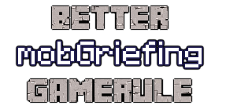

  
[](LICENSE)

## About
"Better mobGriefing GameRule" is a Minecraft mod which improves the
"mobGriefing" game rule, allowing separate values to be specified for
individual types of entity.

## Features

The below game rules can be used to override the mobGriefing behaviour
for the associated entity type, the value of these rules will be used
instead of the original "mobGriefing" game rule.

| Entity      | GameRule                      |
| ----------- | ----------------------------- |
| Blaze       | mobGriefing blaze             |
| Creeper     | mobGriefing creeper           |
| EnderDragon | mobGriefing ender_dragon      |
| Enderman    | mobGriefing enderman          |
| Evoker      | mobGriefing evocation_illager |
| Ghast       | mobGriefing ghast             |
| PigZombie   | mobGriefing zombie_pigman     |
| Rabbit      | mobGriefing rabbit            |
| Sheep       | mobGriefing sheep             |
| Silverfish  | mobGriefing silverfish        |
| SnowMan     | mobGriefing snowman           |
| Villager    | mobGriefing villager          |
| Wither      | mobGriefing wither            |
| Zombie      | mobGriefing zombie            |

Each rule can be set to `true`, `false` or `inherit`, when the value is
`inherit` the entity's mobGriefing behaviour will be inherited from the
original "mobGriefing" game rule.

### Entity Rule Effects
The following list describe the effect of each of the default entity
rules.

 - Blaze
    - Whether the Blaze's fireball can set blocks on fire.
 - Creeper
    - Whether the Creeper's explosion can destroy blocks.
 - EnderDragon
    - Whether the EnderDragon can destroy blocks upon contact.
 - Enderman
    - Whether the Enderman can pick up and/or place blocks.
 - Evoker
    - Whether the Evoker can turn blue sheep in to red sheep.
 - Ghast
    - Whether the Ghast's fireball can destroy blocks.
    - Whether the Ghast's fireball can set blocks on fire.
 - PigZombie
    - Whether the PigZombie can destroy wooden doors.
 - Rabbit
    - Whether the rabbit can eat carrot crops.
 - Sheep
    - Whether the Sheep eating grass damages the grass.
 - Silverfish
    - Whether the Silverfish egg can hatch and destroy the block.
    - Whether the Silverfish can hide and convert stone to monster eggs.
 - SnowMan
    - Whether the SnowMan can place a snow layer as it moves.
 - Villager
    - Whether the Villager can harvest crops.
    - Whether the Villager can pick up loot from the ground.
 - Wither
    - Whether the Wither's spawn explosion can destroy blocks.
    - Whether the Wither's attacks can destroy blocks.
    - Whether the Wither can destroy blocks upon contact.
 - Zombie
    - Whether the Zombie can destroy wooden doors.
    - Whether the Zombie can pick up loot from the ground.

Several behaviours are handled in common code and so can affect multiple
entities, these are detailed below with the entities which use them as
standard.
 - Whether an entity falling upon farmland reverts it to dirt.
   (Used by all entities.)
 - Whether an entity eating grass damages the grass.
   (Used by Sheep only.)
 - Whether an entity can destroy wooden doors.
   (Used by PigZombies and Zombies.)
 - Whether an entity can pick up loot from the ground.
   (Used by PigZombies, Skeletons, Villagers and Zombies.)
 - Whether large fireballs can destroy blocks.
   (Used by Ghasts only.)
 - Whether large fireballs can set blocks on fire.
   (Used by Ghasts only.)
 - Whether wither skull projectiles can destroy blocks.
   (Used by Wither only.)
 - Whether an entity can harvest crops. (Used by Villager only.)

Any entities which include these behaviours can be added to be handled
with a separate entity rule at any time by using the command
`/gamerule mobGriefing <entity-name> <value>`. For example the loot
pickup behaviour of Skeletons is not handled by standard but could be
stopped by using `/gamerule mobGriefing Skeleton false`.

Any changes made by other mods may change the inheritance of mob
griefing behaviour, so creating new entity rules as above may be
necessary to account for changes or new mob types which extend the
original mob types. 

### Configuration
The default values of the mobGriefing game rules can be set using the
in-game configuration menu. Default values can be changed for both the
global mobGriefing game rule and each individual entity.

The specified default values will be used to set the initial mobGriefing
values during world creation as well as for any existing world in which
a given rule does not already exist.

All entities supported out of the box will be added to the configuration
file automatically, additional entities can be added manually to the
configuration file. Once added the entity can then be managed using the
in-game configuration menu.
The entity name specified must match the name as it appears in the
EntityList for that entity, for example `S:zombie_pigman=true`.

The structure of the configuration file follows the Forge structure:
```
# Configuration file
defaultmobgriefingvalues {

    globalrules {
        S:mobGriefing=true|false
    }

    entityrules {
        S:<entity name 1>=true|false|inherit
        ...
        S:<entity name n>=true|false|inherit
    }
}
```

## Versioning
The versioning used for this project uses a combination of the target
Minecraft version and [SemVer](http://semver.org) in the format
`MCVERSION-MAJOR.MINOR.PATCH`.

## License
This project is licensed under the [MIT License (MIT)](LICENSE).
